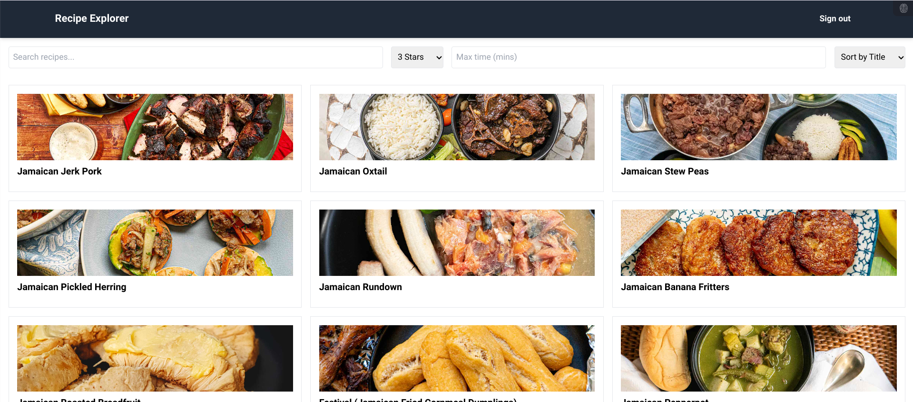

# Recipe Explorer

Recipe Explorer is a React-based web application that allows users to browse and filter a variety of recipes. With a user-friendly interface and seamless integration with Supabase for data storage, this app provides an enjoyable cooking discovery experience.

## Features

- **Recipe Browsing**: Explore a wide range of recipes displayed in an easy-to-navigate card layout.
- **Infinite Scrolling**: Continuously load recipes as you scroll.
- **Detailed Recipe View**: Click on a recipe card to view detailed instructions and ingredients.
- **Search and Filter**: Find recipes by title, rating, and preparation time.
- **Responsive Design**: Optimized for both desktop and mobile devices.
- **User Authentication**: Sign in functionality with Google account integration.

## Technologies Used

- React.js
- Tailwind CSS
- Supabase
- React Router
- Infinite Scroll

